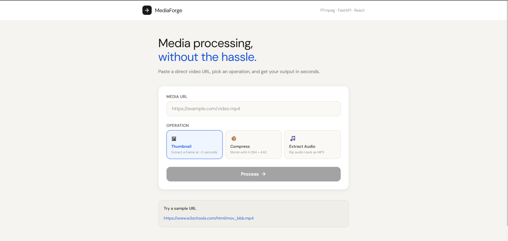
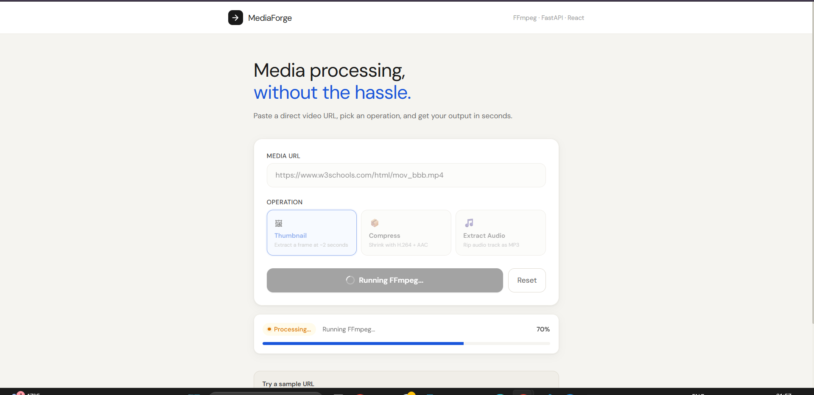
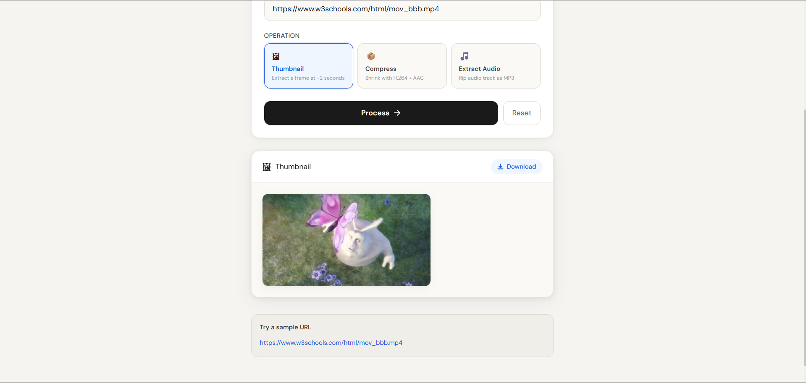

<div align="center">
  
  <h1>MediaForge</h1>
  <p><strong>A modern media processing app (thumbnail, compress, extract audio) powered by FastAPI + FFmpeg + React.</strong></p>

  <p>
    
    
    
    
    
  </p>

  <p>
    <a href="#features">Features</a> •
    <a href="#tech-stack">Tech Stack</a> •
    <a href="#running-the-app">Running the App</a> •
    <a href="#api">API</a> •
    <a href="#project-structure">Project Structure</a>
  </p>
</div>

---

## About

**MediaForge** is a lightweight web app for processing media from a URL. Paste a link, choose an operation, and the backend downloads the media and runs an FFmpeg-based job in the background. You can poll job status and download the final output.

Supported operations:
- **thumbnail** — extracts a frame (around ~2 seconds)
- **compress** — reduces file size (H.264 + AAC)
- **extract_audio** — exports audio as MP3

---

## Features

- URL-based media ingestion (direct file URLs + common platforms via yt-dlp)
- Background job processing with job status polling
- Output hosting from the backend (`/files/...`)
- Simple, clean React UI (operation picker + progress feedback)
- Dockerized full stack (backend + frontend)

---

## Screenshots

Create a folder named `screenshots/` in the repo root and add your images, then update the paths below.

<div align="center">

### Home


### Processing 


### Result


</div>

---

## Tech Stack

### Frontend
- React + Vite
- TailwindCSS
- Nginx (production container)

### Backend
- FastAPI
- Uvicorn
- FFmpeg
- yt-dlp (for supported platforms)
- httpx

---

## Running the App

### Option A — Run with Docker (recommended)

Prerequisites:
- Docker + Docker Compose

From the repo root:

```bash
docker compose up --build
```

- Frontend: http://localhost:3000  
- Backend (Swagger): http://localhost:8000/docs

---

### Option B — Run locally (dev)

#### 1) Backend

Prerequisites:
- Python 3.12+
- FFmpeg installed locally

```bash
cd backend
python -m venv .venv
# activate venv, then:
pip install -r requirements.txt
uvicorn app.main:app --reload --port 8000
```

Backend runs at: http://localhost:8000

#### 2) Frontend

```bash
cd frontend
npm install
npm run dev
```

Vite dev server default: http://localhost:5173

> If your frontend expects the API at a specific host/port, ensure it points to `http://localhost:8000`.

---

## API

### POST `/process`

Creates a background job.

**Body**
```json
{
  "url": "https://www.w3schools.com/html/mov_bbb.mp4",
  "operation": "thumbnail"
}
```

**Response**
```json
{
  "job_id": "uuid-here",
  "status": "queued"
}
```

### GET `/status/{job_id}`

Returns job status + result (once done).

Typical statuses:
- `queued`
- `downloading`
- `processing`
- `done` / `success`
- `error`

### Files

Outputs are served from:

- `GET /files/<filename>`

---

## Project Structure

```text
media-processor/
├── backend/
│   ├── app/
│   │   ├── main.py
│   │   ├── processor.py
│   │   └── job_store.py
│   ├── Dockerfile
│   └── requirements.txt
├── frontend/
│   ├── public/
│   │   └── logo.png
│   ├── src/
│   ├── Dockerfile
│   └── package.json
└── docker-compose.yml
```


